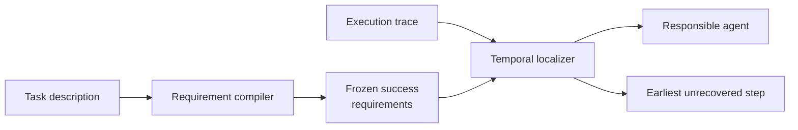

<div align="center">

**Multi-agent execution trace에서 final failure로 이어진 가장 이른 미복구 오류를 agent와 exact step으로 찾는 training-free 평가 프레임워크**


[문제와 목표](#문제와-목표) · [방법](#방법) · [검증 결과](#검증-결과) · [실행](#실행) · [해석 범위](#해석-범위)

</div>

---

## 프로젝트 맥락

| 구분 | 내용 |
|---|---|
| 작업 형태 | 개인 주도 연구 프로젝트 |
| 담당 | 연구 질문, 방법 방향, baseline 조건, evaluation target과 protocol, 결과 해석 |
| 구현 방식 | Codex를 활용한 experiment harness 구축과 반복 검증 |
| 공개 범위 | 실행 코드, synthetic smoke case, aggregate result와 재현 문서 |

## 문제와 목표

Multi-agent system의 trace에는 계획, 도구 호출, 수정 시도와 최종 응답이 함께 남습니다. 최종 응답만 보면 오류가 시작된 위치를 놓치고, trace의 첫 실수만 고르면 이후에 이미 복구된 사건을 원인으로 지목할 수 있습니다.

TSR-Loc은 final failure를 바꾸기 위해 다시 설계해야 할 **가장 이른 미복구 오류**를 찾습니다. Responsible agent와 exact step을 함께 반환하며, 실패 trace를 본 뒤 성공 기준을 바꾸지 않도록 task description만으로 requirement를 먼저 고정합니다.

## 방법



| 설계 | 선택 이유 |
|---|---|
| Task-only requirement compiler | Trace와 attribution label을 보기 전에 성공 조건을 작성해 관찰한 실패에 맞춰 기준이 바뀌는 것을 막았습니다. |
| Recovery-aware localizer | 오류 이후의 step을 함께 읽고 이미 수정된 사건은 제외합니다. 남은 오류 중 가장 이른 지점을 수정 대상으로 선택합니다. |
| Agent와 exact step 분리 평가 | Agent만 맞히면 trace를 다시 읽어야 하고 step만 가까우면 다른 수정 대상을 고를 수 있습니다. 두 accuracy와 tolerance, distance를 따로 기록했습니다. |
| Training-free 비교 | 별도 fine-tuning 없이 같은 model backend와 evaluator 조건에서 baseline을 비교했습니다. |

긴 trace를 chunk로 나눠 다시 읽는 초기 방법은 exact-step 결과를 안정적으로 높이지 못했습니다. 이 결과를 바탕으로 task interpretation과 recovery-aware localization을 분리했습니다. 탐색 과정은 [Experiment history](docs/EXPERIMENT_HISTORY.md), 구현 정의는 [Method](docs/METHOD.md)에 있습니다.

## 검증 결과

주요 비교는 Who&When 184 trajectories, GPT-4o, strict local evaluator 조건입니다.

| Method | Agent accuracy | Exact-step accuracy |
|---|---:|---:|
| Who&When official-style Direct | 51.63% | 8.15% |
| A2P repository-exact reimplementation | **63.04%** | 33.15% |
| **TSR-Loc task-only / No-GT** | 57.61% | **38.59%** |

TSR-Loc의 exact-step accuracy는 Direct보다 `30.43%p` 높았고 paired McNemar `p = 5.77e-12`였습니다. A2P와 비교한 차이는 `5.43%p`였지만 통계적으로 유의하지 않았습니다 (`p = 0.2954`). 따라서 A2P보다 우수하거나 benchmark 전체에서 SOTA라고 주장하지 않습니다.

Compiler와 localizer를 교차한 실험에서는 이 조건에서 localizer 교체의 영향이 더 컸습니다. 전체 집계표는 [Results](results/README.md)에 있습니다.

## 실행

```powershell
python -m venv .venv
.\.venv\Scripts\Activate.ps1
python -m pip install -e ".[test]"
powershell -ExecutionPolicy Bypass -File scripts\run_smoke.ps1 -Python python
```

Smoke test는 synthetic trajectory와 deterministic mock backend만 사용합니다. 실제 benchmark data와 유료 API key는 포함하지 않습니다. 코드는 여러 model backend, retry, sharding, resume와 usage accounting을 지원합니다. 데이터 schema와 평가 기준은 [Data and evaluation](docs/DATA_AND_EVALUATION.md), 실행 조건은 [Reproducibility](docs/REPRODUCIBILITY.md)에 있습니다.

## 해석 범위

- TSR-Loc은 compiler와 localizer를 합친 2-stage algorithm으로 평가했습니다.
- HC-long 23건은 반복 관찰한 post-hoc subset입니다.
- MP-Bench와 TraceElephant 결과는 각 benchmark annotation과 공개 범위 안에서만 해석합니다.
- formal causality, universal SOTA와 모든 baseline 대비 낮은 token cost는 주장하지 않습니다.

## 기여

연구 질문, algorithm 방향, 비교 조건, evaluation target과 protocol, failure analysis를 설계했습니다. Codex를 활용해 experiment harness와 구현을 반복 수정·검증했습니다. 외부 방법과 자체 구현의 경계는 [Third-party notices](THIRD_PARTY_NOTICES.md)에 기록했습니다.

[Method](docs/METHOD.md) · [Evaluation](docs/DATA_AND_EVALUATION.md) · [Results](results/README.md) · [Reproducibility](docs/REPRODUCIBILITY.md)
