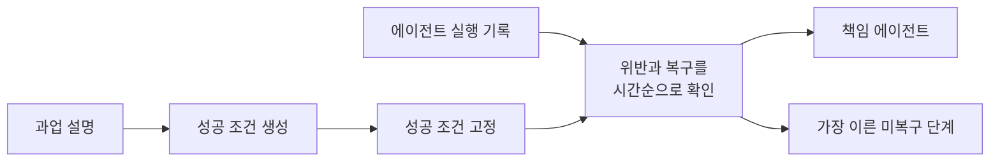

<div align="center">

# 멀티에이전트의 실패 지점 찾기

**실행 기록에서 책임 에이전트와 가장 이른 미복구 단계를 함께 찾습니다.**


[문제](#왜-이-문제를-다뤘나) · [방법](#tsr-loc을-만든-과정) · [결과](#whowhen-평가) · [실행](#빠르게-확인하기) · [한계](#해석-범위)

</div>

## 왜 이 문제를 다뤘나

여러 에이전트가 함께 일하면 하나의 작업 안에 계획, 도구 호출, 잘못된 시도와 수정 과정이 모두 남습니다. 앞에서 나온 오류가 뒤에서 고쳐지기도 하고, 마지막에 드러난 증상은 실제 문제가 시작된 지점보다 한참 뒤에 있을 수 있습니다.

최종 답변이 틀렸다는 사실만으로는 어느 에이전트의 어떤 행동부터 고쳐야 할지 알기 어렵습니다. 이 프로젝트에서는 최종 실패로 이어진 책임 에이전트와, 끝까지 복구되지 않은 가장 이른 단계를 함께 찾는 문제를 다뤘습니다.

## 30초 요약

- 고정 길이 분할과 적응형 분할 등 여러 로그 분할 방법을 먼저 비교했습니다.
- 로그를 나누면 원인과 복구 과정도 함께 끊겨 정확한 단계 추적이 불안정했습니다.
- 실행 기록을 보기 전에 과업의 성공 조건을 만들고, 끝까지 복구되지 않은 첫 위반을 찾는 TSR-Loc으로 방향을 바꿨습니다.
- Who&When 184개 실행 기록에서 정확한 단계 일치율은 38.59%였습니다. Direct보다 높았고, A2P 재구현과의 차이는 통계적으로 유의하지 않았습니다.

## TSR-Loc을 만든 과정

### 로그를 나누는 것만으로는 부족했습니다

처음에는 긴 실행 기록 자체가 문제라고 생각했습니다. 고정 길이 분할, 적응형 분할, 상위 구간 재검토와 재정렬을 구현해 비교했습니다.

- 구간이 작으면 초기 오류와 뒤의 복구 과정이 서로 떨어졌습니다.
- 구간이 크면 긴 문맥을 한 번에 읽는 문제로 돌아왔습니다.
- 일부 조건에서 책임 에이전트 정확도는 올랐지만 정확한 단계는 꾸준히 좋아지지 않았습니다.

이 결과를 보고 로그의 길이보다 실패를 판단할 기준에 집중했습니다. 실행 전에 성공 조건을 고정해 두면, 중간에 고쳐진 오류와 최종 실패로 남은 오류를 구분할 수 있다고 봤습니다.

### TSR-Loc



1. 실행 기록을 보기 전에 과업 설명만으로 성공 조건을 만듭니다.
2. 조건을 고정한 뒤 실행 기록을 시간순으로 읽습니다.
3. 각 위반이 뒤에서 복구됐는지 확인합니다.
4. 끝까지 남은 위반 가운데 가장 이른 단계와 해당 에이전트를 반환합니다.

평가할 때는 이미 복구된 시도를 원인으로 고른 경우, 뒤늦게 나타난 증상을 고른 경우와 단계 번호가 어긋난 경우를 따로 살폈습니다. 비교 방법에도 같은 판정기를 사용했습니다.

### 고정한 평가 조건

| 항목 | 설정 |
|---|---|
| 데이터 | Who&When AG 126건 + HC 58건, 총 184건 |
| 입력 | 과업 설명과 단계 번호가 붙은 전체 실행 기록 |
| TSR-Loc 성공 조건 | 실행 기록, 정답, 실패 라벨을 보기 전에 생성하고 고정 |
| 비교 방법 | Direct, A2P 공개 구현을 기준으로 맞춘 재구현 |
| 주요 실행 모델 | GPT-4o, temperature 0.0 |
| 평가 | 책임 에이전트 정확도와 정확한 단계 일치율을 분리해 계산 |

성공 조건 337개는 두 명이 따로 검토했습니다. 유효하다고 판단한 비율은 각각 97.63%, 96.74%였고 Cohen's kappa는 0.838이었습니다.

## Who&When 평가

| 방법 | 책임 에이전트 정확도 | 정확한 단계 일치율 |
|---|---:|---:|
| Direct | 51.63% | 8.15% |
| A2P 재구현 | **63.04%** | 33.15% |
| **TSR-Loc, 과업 정보만 사용** | 57.61% | **38.59%** |

TSR-Loc의 정확한 단계 일치율은 Direct보다 30.43%p 높았습니다. 대응표본 McNemar 검정의 p값은 `5.77e-12`였습니다.

A2P보다 정확한 단계 일치율은 5.44%p 높았지만 차이는 통계적으로 유의하지 않았습니다(`p=0.2954`). 이 결과로 A2P보다 우수하거나 전체 벤치마크에서 가장 좋은 방법이라고 주장하지 않습니다. 이 실험에서는 로그를 더 잘 나누는 것보다 실행 전에 성공 조건을 분명히 정하는 방식이 정확한 단계 추적에 더 잘 맞았습니다.

## 저장소 구성

```text
failure_attribution/   실행 방법, 모델 연결, 스키마와 평가 지표
configs/               인증 정보를 뺀 예시 설정
data/                  짧은 합성 실행 기록
results/               검증한 집계 결과표
scripts/               결과 점검과 보고서 생성 도구
tests/                 출력 파서와 프롬프트 규칙 테스트
docs/                  방법, 데이터, 실험 이력과 재현 조건
```

## 빠르게 확인하기

```powershell
python -m venv .venv
.\.venv\Scripts\Activate.ps1
python -m pip install -e ".[test]"
powershell -ExecutionPolicy Bypass -File scripts\run_smoke.ps1 -Python python
```

위 명령은 직접 만든 짧은 실행 기록과 고정된 모의 모델로 전체 흐름을 확인합니다. 실제 벤치마크 결과를 다시 만드는 실행은 아닙니다. 전체 실험에는 원 벤치마크 데이터와 모델 API 인증 정보가 필요합니다.

자세한 내용은 [방법과 예시](docs/METHOD.md), [데이터와 평가 기준](docs/DATA_AND_EVALUATION.md), [실험 이력](docs/EXPERIMENT_HISTORY.md), [재현 조건](docs/REPRODUCIBILITY.md)에서 확인할 수 있습니다.

## 해석 범위

- Who&When AG와 HC 184건에서 확인한 결과입니다. 다른 멀티에이전트 구조에 그대로 일반화하지 않습니다.
- A2P 결과는 공개 저장소의 프롬프트와 요청 방식을 맞춘 재구현이며 원 저자의 API 실행 결과가 아닙니다.
- TSR-Loc은 실패를 점검할 후보 위치를 찾습니다. 형식적인 인과관계를 증명하거나 시스템을 자동으로 고치지는 않습니다.
- 로그 분할 실험은 탐색 과정으로 남겼습니다. 모든 조건에서 분할이 효과적이었다고 주장하지 않습니다.
- 유료 API 키, 전체 벤치마크 데이터, 원시 예측 로그와 모델 체크포인트는 공개하지 않았습니다.
