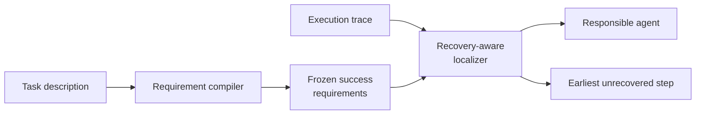

<div align="center">

**여러 AI agent가 함께 수행한 작업이 실패했을 때, 책임 agent와 수정해야 할 정확한 step을 찾습니다.**


[결과](#결과) · [방법](#tsr-loc) · [실행](#실행) · [상세 문서](#상세-문서)

</div>

## 문제

Multi-agent 실행 기록에는 계획, 도구 호출, 수정 시도와 최종 응답이 함께 남습니다. 첫 오류만 고르면 뒤에서 복구된 사건을 원인으로 지목할 수 있고, 최종 응답만 보면 오류가 시작된 위치를 놓칩니다.

목표는 responsible agent뿐 아니라 최종 실패로 이어진 가장 이른 미복구 step을 찾는 것입니다. 그래야 긴 trace를 다시 전부 읽지 않고 수정할 위치를 정할 수 있습니다.

## 방향을 바꾼 이유

처음에는 긴 trace를 잘 나누면 된다고 생각했습니다. Fixed chunk, adaptive chunk, top-k reread와 reranking을 비교했지만 작은 chunk는 원인과 이후 맥락을 분리했고, 큰 chunk는 다시 long-context 문제가 됐습니다. Agent 선택은 일부 나아졌지만 exact step은 안정적으로 개선되지 않았습니다.

그래서 "로그를 어떻게 자를까" 대신 "이 task가 성공하려면 무엇을 끝까지 지켜야 할까"를 먼저 묻도록 바꿨습니다. 이 판단이 requirement compiler와 recovery-aware localizer로 이어졌습니다.

실험의 변화 과정은 [Experiment history](docs/EXPERIMENT_HISTORY.md)에 남겼습니다.

## TSR-Loc



1. Requirement compiler는 trace를 보기 전에 task description만으로 성공 조건을 만듭니다.
2. Localizer는 trace를 시간순으로 읽고 각 조건의 위반과 복구 여부를 확인합니다.
3. 끝까지 복구되지 않은 오류 중 가장 이른 step과 해당 agent를 반환합니다.

Compiler가 trace보다 먼저 조건을 만드는 이유는 실제 실패를 본 뒤 성공 조건을 맞추는 누수를 줄이기 위해서입니다. 모든 방법은 agent와 exact step을 같은 schema로 반환하며 같은 strict evaluator를 사용합니다.

## 평가

| 항목 | 조건 |
|---|---|
| Benchmark | Who&When 184 trajectories |
| Main model | GPT-4o |
| Agent metric | Responsible agent accuracy |
| Step metric | Strict exact-step accuracy |
| Recovery rule | 이후에 복구된 오류는 최종 원인에서 제외 |
| Statistical comparison | Paired McNemar test |

평가 과정에서는 recovered error 선택, downstream symptom 선택, step indexing과 agent/step 의미 혼동을 다시 확인했습니다. 같은 판정 규칙을 Direct, A2P reimplementation과 TSR-Loc에 적용했습니다.

## 결과

| Method | Agent accuracy | Exact-step accuracy |
|---|---:|---:|
| Direct | 51.63% | 8.15% |
| A2P reimplementation | **63.04%** | 33.15% |
| **TSR-Loc task-only / No-GT** | 57.61% | **38.59%** |

TSR-Loc은 Direct 대비 exact-step accuracy가 30.43%p 높았고 paired McNemar p-value는 5.77e-12였습니다. A2P 대비 차이는 통계적으로 유의하지 않았습니다(p = 0.2954).

따라서 A2P보다 우수하거나 benchmark 전체의 SOTA라고 주장하지 않습니다. TSR-Loc은 fine-tuning 없이 task requirement와 recovery state를 이용한 다른 localization 경로입니다.

Main result, factorial comparison과 external transfer 집계표는 [results](results/)에서 확인할 수 있습니다.

## 설계에서 중요했던 점

| 선택 | 이유 |
|---|---|
| Task-only requirement | Trace의 실패를 미리 보고 성공 조건을 맞추지 않기 위해서입니다. |
| Recovery-aware reading | 복구된 첫 실수와 최종 원인을 구분하기 위해서입니다. |
| Agent + exact step | 원인 설명을 실제 수정 위치와 연결하기 위해서입니다. |
| Shared evaluator | 방법마다 유리한 판정 규칙을 쓰지 않기 위해서입니다. |

## 실행

```powershell
python -m venv .venv
.\.venv\Scripts\Activate.ps1
python -m pip install -e ".[test]"
powershell -ExecutionPolicy Bypass -File scripts\run_smoke.ps1 -Python python
```

Smoke test는 synthetic trajectory와 deterministic mock backend를 사용합니다. 실제 benchmark data와 유료 API key는 포함하지 않습니다.

## 저장소 구성

```text
failure_attribution/   methods, model backends, schemas, metrics
configs/               mock, OpenAI-compatible, local-HF config
data/                  synthetic Who&When format sample
docs/                  method, evaluation, experiment history, reproducibility
results/               verified aggregate result tables
scripts/               audit, significance test, report entry point
tests/                 parser, prompt contract, ablation, minimal-pair test
```

Python 3.11+, JSONL과 TOML을 기본으로 사용하며 OpenAI-compatible backend와 optional Hugging Face local backend를 지원합니다. 공개 검증은 pytest, deterministic mock과 GitHub Actions로 실행합니다.

## 상세 문서

- [Method](docs/METHOD.md): algorithm과 worked example
- [Data and evaluation](docs/DATA_AND_EVALUATION.md): dataset schema와 평가 기준
- [Results](results/README.md): baseline과 ablation 결과
- [Experiment history](docs/EXPERIMENT_HISTORY.md): 실패한 접근과 방향 전환
- [Reproducibility](docs/REPRODUCIBILITY.md): 실행 조건

공개 저장소에는 benchmark의 case-level prediction과 원 trajectory 전체를 포함하지 않습니다. TSR-Loc은 formal causality, 모든 dataset으로의 일반화, 모든 baseline 대비 비용 우위를 검증하지 않았습니다.
