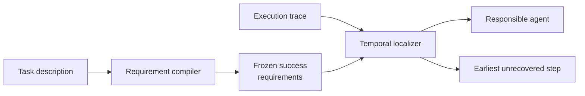

<div align="center">

**Multi-agent execution trace에서 final failure로 이어진 가장 이른 미복구 오류를 agent와 exact step으로 찾는 training-free 평가 프레임워크**


[핵심 결과](#핵심-결과) · [방법](#tsr-loc) · [빠른 실행](#빠른-실행) · [재현 문서](docs/REPRODUCIBILITY.md)

</div>

---

## 문제

Multi-agent system이 실패하면 trace에는 계획, 도구 호출, 수정 시도와 최종 응답이 함께 남습니다. 마지막에 잘못 말한 agent만 찾으면 원인이 된 이전 오류를 놓칠 수 있고, 회복된 실수까지 원인으로 선택할 수 있습니다.

TSR-Loc은 task의 성공 조건을 trace보다 먼저 고정합니다. 그 조건을 기준으로 trace를 시간순으로 검사해 이후에도 복구되지 않은 가장 이른 오류를 responsible agent와 exact step으로 반환합니다.

## TSR-Loc



- compiler는 trace와 attribution label을 보지 않고 task-only success requirements를 작성합니다.
- localizer는 trace를 시간순으로 검사하고 이후에 복구된 오류를 제외합니다.
- 별도 fine-tuning 없이 기존 model backend를 사용합니다.
- agent accuracy와 exact-step accuracy를 분리해 평가합니다.

구현 정의와 worked example은 [Method](docs/METHOD.md)에 있습니다.

## 핵심 결과

주요 비교는 Who&When 184 trajectories, GPT-4o, strict local evaluator 조건입니다.

| Method | Agent accuracy | Exact-step accuracy |
|---|---:|---:|
| Who&When official-style Direct | 51.63% | 8.15% |
| A2P repository-exact reimplementation | **63.04%** | 33.15% |
| **TSR-Loc task-only / No-GT** | 57.61% | **38.59%** |

- Direct 대비 exact-step은 `+30.43%p`였고 paired McNemar `p = 5.77e-12`였습니다.
- A2P 대비 `+5.43%p`였지만 통계적으로 유의하지 않았습니다 (`p = 0.2954`).
- 따라서 A2P보다 우수하다는 주장이나 benchmark-wide SOTA 주장은 하지 않습니다.

Compiler와 localizer를 교차한 실험에서는 이 조건에서 localizer 교체 영향이 더 컸습니다. 탐색 실험과 방향 수정 과정은 [Experiment history](docs/EXPERIMENT_HISTORY.md)에 분리했습니다.

## 구현과 재현

- Direct, step-wise, binary-search, agent-first, A2P, ECHO-style, CCV와 MVBS 조건
- agent, exact-step, tolerance, distance, call count와 token usage evaluator
- OpenAI-compatible, Anthropic, OpenRouter, Hugging Face, Ollama와 llama.cpp backend
- retry, sharding, resume와 usage accounting
- synthetic smoke case와 CI tests

```powershell
python -m venv .venv
.\.venv\Scripts\Activate.ps1
python -m pip install -e ".[test]"
powershell -ExecutionPolicy Bypass -File scripts\run_smoke.ps1 -Python python
```

Smoke test는 synthetic trajectory와 deterministic mock backend만 사용합니다. 실제 benchmark data와 유료 API key는 포함하지 않습니다. 데이터 schema와 평가 기준은 [Data and evaluation](docs/DATA_AND_EVALUATION.md), 실행 조건은 [Reproducibility](docs/REPRODUCIBILITY.md)에 있습니다.

## 저장소 안내

```text
failure_attribution/   schemas, methods, backends and metrics
configs/               secret-free example configurations
data/                  one synthetic smoke case
results/               verified aggregate tables
scripts/               dataset, audit and reporting tools
tests/                 parser and prompt-contract tests
```

코드 진입점은 [Core package map](failure_attribution/README.md)에서 확인할 수 있습니다.

## 해석 범위

- TSR-Loc은 compiler와 localizer를 합친 2-stage algorithm으로 평가했습니다.
- HC-long 23건은 반복 관찰한 post-hoc subset입니다.
- MP-Bench와 TraceElephant 결과는 각 benchmark annotation과 공개 범위 안에서만 해석합니다.
- formal causality, universal SOTA와 모든 baseline 대비 낮은 token cost는 주장하지 않습니다.

## 기여

연구 framing, 실험 설계, baseline 선정과 감사, evaluation protocol, failure analysis와 반복 실행 체계를 설계했습니다. 외부 방법과 자체 구현의 경계는 [Third-party notices](THIRD_PARTY_NOTICES.md)에 기록했습니다.

[Method](docs/METHOD.md) · [Evaluation](docs/DATA_AND_EVALUATION.md) · [Results](results/README.md) · [Reproducibility](docs/REPRODUCIBILITY.md)
