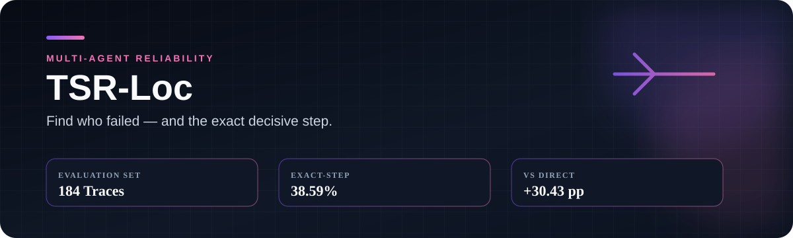
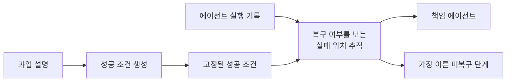

<div align="center">

# 멀티에이전트의 실패 지점 찾기

**TSR-Loc · 책임 에이전트와 가장 이른 미복구 단계를 함께 추적합니다.**


[문제](#문제) · [방향을 바꾼 이유](#방향을-바꾼-이유) · [방법](#tsr-loc) · [결과](#결과) · [실행](#빠르게-확인하기)

</div>

## 30초 요약

- 여러 에이전트가 함께 수행한 작업이 실패했을 때 책임 에이전트와 정확한 실패 단계를 찾는 문제입니다.
- 긴 로그를 나누는 여러 방법을 먼저 시도했지만, 원인과 복구 과정이 함께 끊기는 문제가 있었습니다.
- 로그를 자르는 대신 과업의 성공 조건을 먼저 만들고, 끝까지 복구되지 않은 가장 이른 위반을 찾는 TSR-Loc으로 방향을 바꿨습니다.
- Who&When 184개 실행 기록에서 정확한 단계 일치율은 38.59%였습니다. Direct보다 높았지만 A2P와의 차이는 통계적으로 유의하지 않았습니다.

## 문제

멀티에이전트 실행 기록에는 계획, 도구 호출, 잘못된 시도, 수정 과정과 최종 답변이 한꺼번에 남습니다. 처음 나온 오류가 뒤에서 고쳐지기도 하고, 마지막에 드러난 증상은 실제 원인보다 한참 뒤에 있을 수 있습니다.

이 프로젝트의 목표는 실패 문장을 하나 찾는 것이 아닙니다. 최종 실패로 이어진 책임 에이전트와, 이후에도 복구되지 않은 가장 이른 단계를 함께 찾는 것입니다. 그래야 긴 기록을 처음부터 다시 읽지 않고도 먼저 고칠 위치를 정할 수 있습니다.

## 방향을 바꾼 이유

처음에는 긴 로그 자체가 문제라고 생각했습니다. 고정 길이 분할, 적응형 분할, 상위 구간 재검토와 재정렬을 비교했습니다.

- 구간이 작으면 원인과 이후의 복구 과정이 서로 떨어졌습니다.
- 구간이 크면 다시 긴 문맥을 한 번에 읽어야 했습니다.
- 일부 조건에서 책임 에이전트는 더 잘 찾았지만, 정확한 단계는 안정적으로 좋아지지 않았습니다.

여기서 질문을 바꿨습니다. "로그를 어디서 자를까"보다 "이 과업이 성공하려면 끝까지 지켜야 할 조건은 무엇일까"를 먼저 묻기로 했습니다.

## TSR-Loc



1. 실행 기록을 보기 전에 과업 설명만으로 성공 조건을 만듭니다.
2. 실행 기록을 시간순으로 읽으며 각 조건의 위반과 복구 여부를 확인합니다.
3. 끝까지 복구되지 않은 위반 가운데 가장 이른 단계와 해당 에이전트를 반환합니다.

평가 과정에서는 이미 복구된 오류를 원인으로 고르는 경우, 뒤늦게 나타난 증상을 고르는 경우, 단계 번호가 어긋나는 경우를 따로 확인했습니다. 비교 방법에도 같은 판정 규칙을 적용했습니다.

## 결과

Who&When 184개 실행 기록을 GPT-4o와 고정된 로컬 평가기로 비교했습니다.

| 방법 | 책임 에이전트 정확도 | 정확한 단계 일치율 |
|---|---:|---:|
| Direct | 51.63% | 8.15% |
| A2P 재구현 | **63.04%** | 33.15% |
| **TSR-Loc, 과업 정보만 사용** | 57.61% | **38.59%** |

TSR-Loc의 정확한 단계 일치율은 Direct보다 30.43%p 높았습니다. 대응표본 McNemar 검정의 p값은 `5.77e-12`였습니다. A2P보다 수치는 높았지만 두 방법의 차이는 통계적으로 유의하지 않았습니다(`p=0.2954`). 따라서 A2P보다 우수하거나 전체 벤치마크의 최고 방법이라고 주장하지 않습니다.

이 결과에서 가장 중요하게 본 부분은 로그를 더 정교하게 나누는 것보다, 실패를 판단할 기준을 실행 전에 분명히 하는 편이 정확한 단계 추적에 도움이 됐다는 점입니다.

## 빠르게 확인하기

```powershell
python -m venv .venv
.\.venv\Scripts\Activate.ps1
python -m pip install -e ".[test]"
powershell -ExecutionPolicy Bypass -File scripts\run_smoke.ps1 -Python python
```

이 실행은 직접 만든 짧은 실행 기록과 결정적인 모의 모델을 사용해 전체 흐름을 확인합니다. 실제 벤치마크 데이터와 유료 API 인증 정보는 포함하지 않습니다.

## 저장소 구성

```text
failure_attribution/   실행 방법, 모델 연결, 스키마와 평가 지표
configs/               인증 정보를 뺀 예시 설정
data/                  짧은 합성 실행 기록
results/               검증한 집계 결과표
scripts/               결과 점검과 보고서 생성 도구
tests/                 출력 파서와 프롬프트 규칙 테스트
```

## 더 자세한 내용

- [방법과 예시](docs/METHOD.md)
- [데이터와 평가 기준](docs/DATA_AND_EVALUATION.md)
- [집계 결과](results/README.md)
- [실패한 접근과 방향 전환](docs/EXPERIMENT_HISTORY.md)
- [재현 조건](docs/REPRODUCIBILITY.md)

TSR-Loc은 추가 학습 없이 성공 조건 생성기와 실패 위치 추적기를 결합한 평가 방법입니다. 형식적 인과관계, 모든 데이터셋으로의 일반화, 모든 비교 방법보다 낮은 비용은 검증하지 않았습니다.
