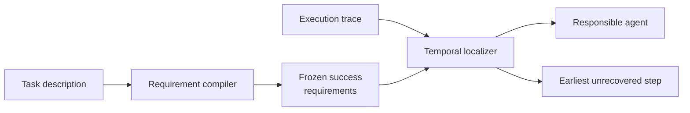

<div align="center">

**멀티에이전트 실행 기록에서 최종 실패로 이어진 에이전트와 수정해야 할 정확한 단계를 찾습니다.**


</div>

## 문제

멀티에이전트 시스템이 실패하면 실행 기록에는 계획, 도구 호출, 다른 에이전트의 수정 시도와 최종 응답이 함께 남습니다. 최종 응답만 봐서는 오류가 시작된 위치를 알기 어렵습니다. 반대로 기록에서 가장 먼저 나온 실수를 고르면 이후 단계에서 이미 복구된 사건을 원인으로 지목할 수 있습니다.

이 프로젝트가 찾는 대상은 단순한 첫 오류가 아닙니다. 최종 실패까지 복구되지 않은 오류 중 가장 이른 단계입니다. 책임 에이전트와 정확한 단계를 함께 찾아야 어느 프롬프트, 도구 호출 또는 인계 규칙을 고칠지 결정할 수 있습니다.

## TSR-Loc



### 성공 기준을 먼저 고정

실패 기록을 읽은 뒤 성공 조건을 만들면 관찰한 오류에 맞춰 기준이 달라질 수 있습니다. Requirement compiler에는 작업 설명만 제공하고, 실행 기록과 정답 라벨을 보기 전에 성공 조건을 작성하게 했습니다. Localizer는 이 고정된 기준으로 기록을 읽습니다.

### 복구된 오류를 제외

Localizer는 각 오류 후보 뒤의 단계를 확인합니다. 이후 에이전트가 문제를 수정했다면 후보에서 제외하고, 최종 결과에 남아 있는 오류 중 가장 이른 단계를 선택합니다. 별도 파인튜닝 없이 기존 언어모델을 사용했습니다.

### 에이전트와 단계를 따로 평가

책임 에이전트를 맞혀도 정확한 행동을 찾지 못하면 기록을 다시 읽어야 합니다. 단계 위치가 가까워도 다른 에이전트를 선택하면 수정 대상이 달라집니다. 그래서 agent accuracy와 exact-step accuracy를 분리하고, 정답 단계와의 거리도 함께 측정했습니다.

구현 정의와 예시는 [Method](docs/METHOD.md)에 있습니다.

## 결과

주요 비교는 Who&When 184개 trajectory를 GPT-4o와 strict local evaluator로 평가한 결과입니다.

| 방법 | Agent accuracy | Exact-step accuracy |
|---|---:|---:|
| Who&When official-style Direct | 51.63% | 8.15% |
| A2P repository-exact reimplementation | **63.04%** | 33.15% |
| **TSR-Loc task-only / No-GT** | 57.61% | **38.59%** |

TSR-Loc의 exact-step accuracy는 Direct보다 `30.43%p` 높았고 paired McNemar 검정의 `p` 값은 `5.77e-12`였습니다. A2P보다 `5.43%p` 높았지만 이 차이는 통계적으로 유의하지 않았습니다 (`p = 0.2954`). 따라서 A2P보다 우수하거나 전체 벤치마크에서 최고 성능이라고 주장하지 않습니다.

Compiler와 localizer를 교차한 2×2 실험에서는 localizer를 바꿨을 때 exact-step 성능 변화가 더 컸습니다. 초기에는 긴 기록을 chunk로 나눠 다시 읽는 방법도 시도했지만 단계 탐지 성능이 안정적으로 개선되지 않았습니다. 이 실패가 task interpretation과 recovery-aware localization을 분리하는 현재 구조로 이어졌습니다. 자세한 과정은 [Experiment history](docs/EXPERIMENT_HISTORY.md), 집계 결과는 [Results](results/README.md)에 있습니다.

## 실행

```powershell
python -m venv .venv
.\.venv\Scripts\Activate.ps1
python -m pip install -e ".[test]"
powershell -ExecutionPolicy Bypass -File scripts\run_smoke.ps1 -Python python
```

Smoke test는 합성 trajectory와 deterministic mock backend를 사용합니다. 실제 벤치마크 데이터와 유료 API key는 포함하지 않습니다. 실행기는 OpenAI-compatible, Anthropic, OpenRouter, Hugging Face, Ollama와 llama.cpp backend를 지원하며, 중단된 실험을 이어서 실행할 수 있습니다.

## 한계

- TSR-Loc은 requirement compiler와 localizer를 합친 2단계 방법으로 평가했습니다.
- HC-long 23건은 반복 관찰 뒤 정한 사후 부분집합입니다.
- MP-Bench와 TraceElephant 결과는 각 데이터의 주석과 공개 범위 안에서만 해석해야 합니다.
- 인과적 책임 판정, 모든 벤치마크에서의 최고 성능과 모든 기준선보다 낮은 비용은 주장하지 않습니다.

## 작업 범위

개인 주도 연구 프로젝트로 연구 질문, 방법 방향, 비교 조건, 평가 대상과 프로토콜, 실패 분석을 설계했습니다. Codex를 사용해 실험 실행기와 구현을 반복 수정하고 검증했습니다. 외부 방법과 자체 구현의 경계는 [Third-party notices](THIRD_PARTY_NOTICES.md)에 기록했습니다.

[Method](docs/METHOD.md) · [Evaluation](docs/DATA_AND_EVALUATION.md) · [Results](results/README.md) · [Reproducibility](docs/REPRODUCIBILITY.md)
