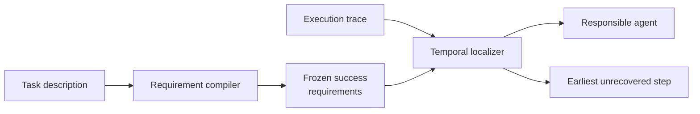

<div align="center">

**Multi-agent execution trace에서 final failure로 이어진 가장 이른 미복구 오류를 agent와 exact step으로 찾는 training-free 평가 프레임워크**


[검증 결과](#검증-결과) · [방법](#tsr-loc-구조) · [빠른 실행](#구현과-재현) · [재현 문서](docs/REPRODUCIBILITY.md)

</div>

---

## 프로젝트 맥락

| 구분 | 내용 |
|---|---|
| 작업 형태 | 개인 주도 연구 프로젝트 |
| 담당 | 연구 질문, 방법 방향, baseline 조건, evaluation target과 protocol, 결과 해석 |
| 구현 방식 | Codex를 활용한 experiment harness 구축과 반복 검증 |
| 공개 범위 | 실행 코드, synthetic smoke case, aggregate result와 재현 문서 |

## 평가 제약

Multi-agent system이 실패하면 trace에는 계획, 도구 호출, 수정 시도와 최종 응답이 함께 남습니다. 최종 응답만 보면 앞에서 시작된 오류를 놓치고, trace의 첫 실수만 고르면 이후에 이미 복구된 사건을 원인으로 지목할 수 있습니다. 긴 실행 기록을 사람이 매번 처음부터 읽는 것도 운영 가능한 평가 방식이 아닙니다.

## 연구 질문

> Final failure로 이어진 오류를, responsible agent뿐 아니라 다시 설계해야 할 exact step까지 찾을 수 있는가?

여기서 찾고자 한 대상은 단순한 최초 오류가 아닙니다. 이후 step에서도 복구되지 않은 가장 이른 오류입니다. 또한 실패 trace를 본 뒤 성공 기준을 바꾸지 않도록 task description만으로 requirement를 먼저 고정했습니다.

## 접근과 선택 이유

TSR-Loc은 task 해석과 trace localization을 두 단계로 나눕니다. Requirement compiler는 trace를 보기 전에 성공 조건을 작성하고, localizer는 그 기준으로 trace를 시간순으로 검사해 responsible agent와 earliest unrecovered step을 반환합니다.

### 왜 task requirement를 먼저 고정했는가

Trace와 최종 실패를 먼저 본 뒤 성공 조건을 만들면 관찰한 오류에 맞춰 기준을 바꾸게 됩니다. 이를 막기 위해 requirement compiler에는 task description만 제공해 성공 조건을 먼저 작성하고, localizer가 나중에 그 기준으로 trace를 읽도록 분리했습니다.

### 왜 최초 오류가 아니라 최초 미복구 오류인가

Agent는 중간에 실수해도 다음 step에서 수정할 수 있습니다. 단순히 가장 이른 오류를 고르면 최종 실패에 영향을 주지 않은 사건까지 원인으로 지목하게 됩니다. TSR-Loc은 이후 step에서 복구됐는지를 함께 확인하고, 최종 결과를 바꾸기 위해 다시 설계해야 할 가장 이른 지점을 선택합니다.

### 왜 agent와 exact step을 따로 평가했는가

책임 agent를 맞혀도 어느 action을 고쳐야 하는지 모르면 trace를 다시 전부 읽어야 합니다. 반대로 step 위치만 가까워도 다른 agent를 선택하면 수정 대상이 달라집니다. 그래서 agent accuracy와 exact-step accuracy를 분리하고, 정답 step에 얼마나 가까웠는지는 tolerance와 distance로 따로 기록했습니다.

## TSR-Loc 구조



- compiler는 trace와 attribution label을 보지 않고 task-only success requirements를 작성합니다.
- localizer는 trace를 시간순으로 검사하고 이후에 복구된 오류를 제외합니다.
- 별도 fine-tuning 없이 기존 model backend를 사용합니다.
- agent accuracy와 exact-step accuracy를 분리해 평가합니다.

구현 정의와 worked example은 [Method](docs/METHOD.md)에 있습니다.

## 검증 결과

주요 비교는 Who&When 184 trajectories, GPT-4o, strict local evaluator 조건입니다.

| Method | Agent accuracy | Exact-step accuracy |
|---|---:|---:|
| Who&When official-style Direct | 51.63% | 8.15% |
| A2P repository-exact reimplementation | **63.04%** | 33.15% |
| **TSR-Loc task-only / No-GT** | 57.61% | **38.59%** |

- Direct 대비 exact-step은 `+30.43%p`였고 paired McNemar `p = 5.77e-12`였습니다.
- A2P 대비 `+5.43%p`였지만 통계적으로 유의하지 않았습니다 (`p = 0.2954`).
- 따라서 A2P보다 우수하다는 주장이나 benchmark-wide SOTA 주장은 하지 않습니다.

Compiler와 localizer를 교차한 실험에서는 이 조건에서 localizer 교체 영향이 더 컸습니다. 탐색 실험과 방향 수정 과정은 [Experiment history](docs/EXPERIMENT_HISTORY.md)에 분리했습니다.

초기에는 fixed·adaptive chunk, top-k reread, multi-view와 pairwise reranking처럼 긴 trace를 나누고 다시 읽는 방법을 실험했습니다. 작은 chunk는 원인과 이후 맥락을 분리했고, 큰 chunk는 long-context 문제로 돌아갔습니다. Agent 선택은 일부 조건에서 좋아졌지만 exact-step 결과는 안정적으로 개선되지 않았습니다. 이 실패를 바탕으로 chunking을 주된 주장에서는 내리고, task interpretation과 recovery-aware localization을 분리하는 방향으로 바꿨습니다.

## 구현과 재현

- Direct, step-wise, binary-search, agent-first, A2P, ECHO-style, CCV와 MVBS 조건
- agent, exact-step, tolerance, distance, call count와 token usage evaluator
- OpenAI-compatible, Anthropic, OpenRouter, Hugging Face, Ollama와 llama.cpp backend
- retry, sharding, resume와 usage accounting
- synthetic smoke case와 CI tests

```powershell
python -m venv .venv
.\.venv\Scripts\Activate.ps1
python -m pip install -e ".[test]"
powershell -ExecutionPolicy Bypass -File scripts\run_smoke.ps1 -Python python
```

Smoke test는 synthetic trajectory와 deterministic mock backend만 사용합니다. 실제 benchmark data와 유료 API key는 포함하지 않습니다. 데이터 schema와 평가 기준은 [Data and evaluation](docs/DATA_AND_EVALUATION.md), 실행 조건은 [Reproducibility](docs/REPRODUCIBILITY.md)에 있습니다.

## 저장소 안내

```text
failure_attribution/   schemas, methods, backends and metrics
configs/               secret-free example configurations
data/                  one synthetic smoke case
results/               verified aggregate tables
scripts/               dataset, audit and reporting tools
tests/                 parser and prompt-contract tests
```

코드 진입점은 [Core package map](failure_attribution/README.md)에서 확인할 수 있습니다.

## 해석 범위

- TSR-Loc은 compiler와 localizer를 합친 2-stage algorithm으로 평가했습니다.
- HC-long 23건은 반복 관찰한 post-hoc subset입니다.
- MP-Bench와 TraceElephant 결과는 각 benchmark annotation과 공개 범위 안에서만 해석합니다.
- formal causality, universal SOTA와 모든 baseline 대비 낮은 token cost는 주장하지 않습니다.

## 기여

연구 질문, algorithm 방향, 비교 조건, evaluation target과 protocol, failure analysis를 설계했습니다. Codex를 활용해 experiment harness와 구현을 반복 수정·검증했습니다. 외부 방법과 자체 구현의 경계는 [Third-party notices](THIRD_PARTY_NOTICES.md)에 기록했습니다.

[Method](docs/METHOD.md) · [Evaluation](docs/DATA_AND_EVALUATION.md) · [Results](results/README.md) · [Reproducibility](docs/REPRODUCIBILITY.md)
