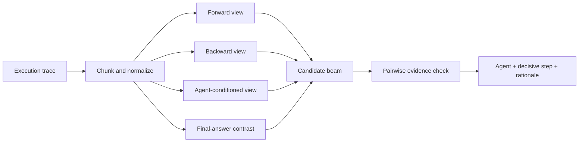

# Multi-Agent Failure Localization

> 긴 멀티에이전트 실행 로그에서 실패를 일으킨 **책임 에이전트**와 **결정적 단계**를 찾는 연구·평가 프로젝트입니다.

**Status:** Experimental research · Benchmark hardening in progress

## 문제 정의

멀티에이전트 시스템이 마지막 답변에서 실패했더라도 원인은 훨씬 앞선 단계에 있을 수 있습니다. 모든 로그를 한 번에 읽는 방식은 긴 문맥에서 근거를 놓치기 쉽고, 마지막 오류만 원인으로 오인할 위험도 있습니다.

이 프로젝트는 실패를 다음 단위로 분해합니다.

- 책임 에이전트(Who)
- 결정적 실패 시점(When)
- 근본 원인과 이후 전파 과정
- 복구 가능했던 지점과 최종 실패 지점

## 내가 주도한 부분

- 긴 실행 trace의 책임 소재를 agent와 step의 결합 문제로 정의
- all-at-once, step-by-step, binary search, agent-first 탐색 전략 비교
- forward/backward/agent-conditioned/final-answer-contrast 관점을 결합한 후보 탐색 설계
- 후보 beam을 만든 뒤 pairwise comparison으로 근거를 재검토하는 절차 설계
- Task-only CCV 실험으로 GT 조건과 추가 추론 호출의 효과를 분리하는 후속 실험 제안

## 분석 흐름

## 현재까지의 관찰

- HC-long 23개 사례의 소규모 Task-only CCV 비교에서 No-GT와 Full-CCV의 joint accuracy가 모두 `26.09%`였습니다.
- 이 결과만으로 GT 조건의 효과를 결론 내릴 수는 없습니다.
- 다음 실험은 전체 184개 사례에서 one-call, generic two-call, constraint-guided two-call을 분리 비교하여 `추가 호출 효과`와 `제약 효과`를 구분하는 것입니다.

## 실패 분류

- root cause: 최초의 원인
- propagation: 잘못된 상태가 다음 agent로 전달된 과정
- recovery opportunity: 수정 가능했던 단계
- terminal failure: 최종 출력에서 드러난 실패

## 현재 한계

- 표본이 작아 신뢰구간과 일반화 성능을 제시하기 어렵습니다.
- 일부 실행 스크립트와 로그 형식을 재현 가능한 형태로 정리해야 합니다.
- LLM-as-a-Judge의 위치 편향과 자기일관성 검증이 추가로 필요합니다.

## 다음 구현 목표

- [ ] JSON Schema 기반 trace 표준화
- [ ] agent/step 단위 정답과 평가 CLI
- [ ] 전체 벤치마크 재실행 및 bootstrap CI
- [ ] async ingestion과 긴 로그 chunk cache
- [ ] Docker·CI·회귀 테스트
- [ ] OpenTelemetry trace 입력 어댑터

자세한 학습 계획은 [LEARNING_ROADMAP.md](docs/LEARNING_ROADMAP.md)에 정리했습니다.

## 개발 방식

AI 코딩 도구를 실험 코드와 디버깅에 활용했습니다. 문제 구조화, 탐색 전략, 비교 실험, 실패 taxonomy와 결과 해석은 직접 주도했습니다. 공개 코드는 입력 스키마·고정 seed·테스트를 통해 재현 가능하게 보강합니다.

