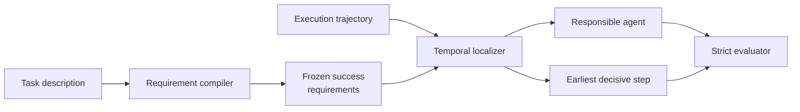

<div align="center">

**긴 multi-agent trace에서 책임 agent와 결정적 실패 step을 찾는 training-free 평가 연구**


[핵심 결과](#핵심-결과) · [방법](#tsr-loc-in-one-diagram) · [빠른 실행](#quick-start) · [한국어 설명](docs/PORTFOLIO_KO.md)

</div>

---

## 30초 요약

| 질문 | 답 |
|---|---|
| **문제** | 최종 실패를 만든 agent와 정확한 최초 결정적 step을 trace에서 어떻게 찾을까? |
| **접근** | task 해석을 frozen success requirements로 먼저 고정한 뒤 trajectory를 시간순 분석 |
| **평가** | Who&When 184 trajectories, strict local evaluator, paired significance |
| **결과** | task-only TSR-Loc exact-step **38.59%**, Direct **8.15%** 대비 **+30.43%p** |
| **공개 증거** | 실험 harness, method registry, model backends, 결과표, 테스트, CI |

<table>
<tr>
<td width="25%" align="center"><h3>184</h3><sub>Who&amp;When<br/>Trajectories</sub></td>
<td width="25%" align="center"><h3>38.59%</h3><sub>Task-only<br/>Exact-step</sub></td>
<td width="25%" align="center"><h3>+30.43%p</h3><sub>Exact-step<br/>vs Direct</sub></td>
<td width="25%" align="center"><h3>p = 5.77e-12</h3><sub>Paired<br/>McNemar</sub></td>
</tr>
</table>

> TSR-Loc은 production monitoring service가 아니라 **검증 가능한 research artifact**입니다. benchmark-wide SOTA나 형식적 인과 검증은 주장하지 않습니다.

## Why exact-step attribution matters

“이 실행은 실패했다”만으로는 agent system을 고치기 어렵습니다. 운영자가 필요한 것은 다음 세 가지입니다.

1. 어떤 agent가 책임 있는가?
2. 어느 step에서 회복되지 않은 오류가 처음 발생했는가?
3. 그 판단이 task 요구조건과 어떤 관계가 있는가?

직접 전체 trace를 한 번에 판정하면 task 해석과 trace evidence가 섞이기 쉽습니다. TSR-Loc은 두 단계를 분리합니다.

## TSR-Loc in one diagram



- **Compiler:** execution trace와 gold attribution을 보지 않고 성공 요구조건을 작성
- **Localizer:** trace를 시간순으로 읽고, 나중에 복구된 오류는 제외
- **Decision rule:** 최소 수정으로 최종 결과가 바뀌는 가장 이른 미복구 오류를 선택

## 핵심 결과

### Who&When · 184 trajectories · GPT-4o

| Method | Agent accuracy | Exact-step accuracy |
|---|---:|---:|
| Who&When official-style Direct | 51.63% | 8.15% |
| A2P repository-exact reimplementation | **63.04%** | 33.15% |
| **TSR-Loc task-only / No-GT** | 57.61% | **38.59%** |
| TSR-Loc GT-assisted | 60.33% | **39.67%** |

- Direct → task-only TSR-Loc exact-step: **+30.43%p**, paired McNemar `p = 5.77e-12`
- A2P → task-only TSR-Loc: **+5.43%p**, 통계적으로 유의하지 않음 `p = 0.2954`
- HC-long 23건은 반복 관찰된 post-hoc subset이므로 일반적 long-trace 우위를 주장하지 않음

### What the factorial experiment showed

compiler와 localizer 모델을 교차한 실험에서 이 모델 조합에서는 compiler 교체 영향이 작았고, localizer 교체가 exact-step accuracy를 약 19%p 변화시켰습니다. 즉, 이 결과에서는 자연어 요구조건 생성 자체보다 **trace localization capacity**가 더 큰 병목 후보였습니다.

## Engineering scope

- agent accuracy, exact-step, tolerance, step distance, call count, token usage 통합 evaluator
- Direct, step-wise, binary-search, agent-first, A2P, ECHO-style, CCV, MVBS 조건
- OpenAI-compatible, Anthropic, OpenRouter, Hugging Face, Ollama, llama.cpp backends
- retry, sharding, resume, usage accounting
- Who&When·MP-Bench·TraceElephant 변환 및 평가 utilities
- deterministic mock smoke test와 GitHub Actions

## Repository map

```text
failure_attribution/   schemas, prompts, methods, backends, metrics
configs/               secret-free example configurations
data/                  one synthetic smoke-test case
results/               verified aggregate tables
scripts/               dataset, audit, significance, reporting tools
tests/                 parser and prompt-contract tests
docs/                  method, results, reproducibility, Korean narrative
assets/                portfolio hero artwork
run_experiment.py      unified experiment runner
```

처음 코드를 읽는다면 [failure_attribution/README.md](failure_attribution/README.md)의 code map부터 보는 것이 가장 빠릅니다.

## Quick start

```powershell
python -m venv .venv
.\.venv\Scripts\Activate.ps1
python -m pip install -e ".[test]"
powershell -ExecutionPolicy Bypass -File scripts\run_smoke.ps1 -Python python
```

smoke test는 deterministic mock backend와 synthetic trajectory를 사용하며 유료 API를 호출하지 않습니다.

실제 실험 예시는 [configs/openai.example.toml](configs/openai.example.toml)과 [데이터·평가 문서](docs/DATA_AND_EVALUATION.md)를 참고하세요.

## Claim boundaries

- TSR-Loc은 compiler+localizer의 전체 2-stage algorithm으로 평가했습니다.
- A2P 대비 exact-step 차이는 통계적으로 유의하지 않았습니다.
- HC-long은 23개 post-hoc case입니다.
- MP-Bench 평가는 multiple expert annotation 호환성이지 저자 시스템의 완전 재현이 아닙니다.
- TraceElephant compact 결과는 native full-observability 결과가 아닙니다.
- universal SOTA와 token efficiency는 주장하지 않습니다.

## Ownership & collaboration

연구 framing, 실험 설계, 비교 기준, failure analysis, evaluation protocol과 반복 검증을 직접 주도했습니다. Codex는 구현·분석 협업에 활용했습니다. 선행연구와 구현 경계는 [THIRD_PARTY_NOTICES.md](THIRD_PARTY_NOTICES.md)와 [한국어 프로젝트 설명](docs/PORTFOLIO_KO.md)에 구분했습니다.

**Deep dive** · [Method](docs/METHOD.md) · [Results](results/README.md) · [Reproducibility](docs/REPRODUCIBILITY.md) · [Roadmap](docs/LEARNING_ROADMAP.md)
