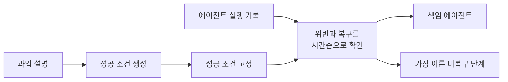
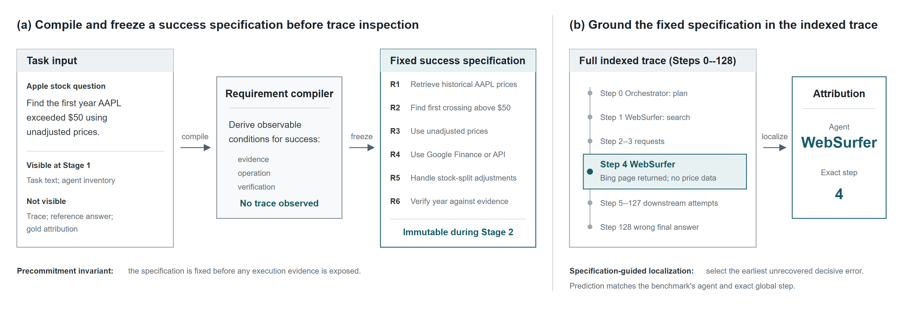
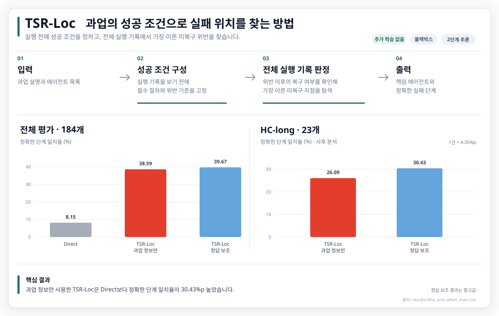
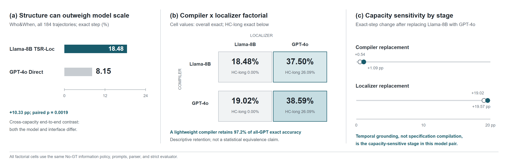

<div align="center">

# TSR-Loc: Multi-Agent Failure Localization

**멀티에이전트 작업이 실패했을 때, 어떤 에이전트의 어느 행동부터 확인해야 하는지 찾는 연구입니다.**


[문제](#1-왜-실패-위치까지-찾아야-하는가) · [아이디어](#2-아이디어의-출발점-성공-명세를-trace보다-먼저-만든다) · [방법](#4-tsr-loc은-어떻게-찾는가) · [결과](#6-검증-결과) · [활용](#7-운영에서-어떻게-쓰는가) · [실행](#9-실행-방법)

</div>

실패한 작업의 로그가 길면 마지막 오답만으로 수정할 곳을 알기 어렵습니다. TSR-Loc은 **과업이 성공하려면 지켜야 할 명세를 먼저 만들고, 로그를 그 명세와 대조**합니다. 뒤에서 복구된 실수는 제외하고, 끝까지 남은 위반 중 가장 이른 에이전트와 단계를 제시합니다. 회귀 테스트나 장애 분석에서 사람이 검토를 시작할 위치를 정하는 데 활용할 수 있습니다.

Who&When의 실패 실행 184건에서, 정답 단계와 정확히 일치한 비율은 전체 로그를 한 번에 판정하는 Direct의 8.15%에서 TSR-Loc의 38.59%로 높아졌습니다. A2P 재구현과의 차이는 통계적으로 유의하지 않았습니다. 이 결과를 바탕으로 성공 명세 생성과 실패 위치 판정을 나눈 방식의 가능성과 한계를 검토했습니다.

## 1. 왜 실패 위치까지 찾아야 하는가

규제 대응 멀티에이전트 시스템의 실패를 진단하는 연구 과제에서 출발했습니다. 당시 시스템 본체는 다른 기관에서 구축 중이어서, 전체 서비스가 완성되기 전에도 공개 실행 로그로 검증할 수 있는 실패 위치 탐지를 먼저 다뤘습니다.

멀티에이전트 시스템에서는 계획, 검색, 도구 실행과 답변 작성이 여러 에이전트에 걸쳐 이어집니다. 한 에이전트가 잘못된 근거를 가져오면 뒤의 에이전트가 정확하게 계산하더라도 최종 답은 틀릴 수 있습니다. 반대로 앞의 잘못된 시도를 뒤에서 바로잡기도 합니다.

따라서 눈에 띄는 첫 오류나 마지막 오답을 고르는 것만으로는 부족합니다. 최종 실패로 이어진 가장 이른 미복구 단계(earliest unrecovered failure)를 찾고, 해당 에이전트를 함께 반환하도록 문제를 정했습니다.

| 조건 | 가정한 상황 |
|---|---|
| System | Planner, tool agent, reviewer처럼 여러 agent가 하나의 task를 이어서 처리합니다. |
| Observation | Agent와 global step이 표시된 전체 execution trace를 사후에 읽을 수 있습니다. |
| Model access | 내부 weight나 gradient를 쓰지 않는 black-box setting입니다. |
| Monitoring label | Localization 시점에는 gold failure agent와 step을 입력으로 사용하지 않습니다. |
| Output | 자동 수정 대신 사람이 먼저 확인할 `(agent, step)` 후보를 반환합니다. |

## 2. 아이디어의 출발점: 성공 명세를 trace보다 먼저 만든다

> **과업이 성공하려면 지켜야 할 명세를 먼저 만들고, 실행 기록을 그 기준과 비교하면 실패 위치를 더 정확히 찾을 수 있지 않을까?**

TSR-Loc은 task description과 agent 목록만 보고 `task-derived success requirements`를 작성합니다. 이 명세는 trace, reference answer와 gold failure label을 보기 전에 고정합니다. 실행 결과를 이미 본 상태에서 실패 이유에 맞춰 기준을 만드는 일을 피하려는 설계입니다. 그다음 전체 trace를 시간순으로 읽으며 requirement 위반과 이후 복구 여부를 함께 확인합니다.

## 3. 분할 실험에서 성공 명세로

처음에는 긴 로그를 나누면 실패 위치를 찾기 쉬울 것이라고 생각해 고정·적응형 분할, 상위 구간 재검토와 재정렬을 비교했습니다. 하지만 작은 구간은 원인과 복구 과정을 갈라놓고, 큰 구간은 다시 긴 문맥을 판정해야 했습니다. 구간 크기와 검토할 후보 수를 바꿔도 정확한 단계 일치율이 일관되게 좋아지지 않았습니다.

이 결과를 보고, 로그를 나누기 전에 실패 판정의 기준부터 정하기로 했습니다. 분할 실험의 설정과 수치는 [실험 이력](docs/EXPERIMENT_HISTORY.md)에 남겼습니다.

## 4. TSR-Loc은 어떻게 찾는가

TSR-Loc은 requirement compiler와 trace localizer의 두 단계로 실행됩니다. 별도 fine-tuning 없이 LLM을 두 번 호출하며, localizer는 원래 로그의 global step 번호를 유지합니다.


```mermaid
flowchart LR
    T["과업 설명"] --> C["성공 조건 생성"]
    C --> R["성공 조건 고정"]
    X["에이전트 실행 기록"] --> L["위반과 복구를<br/>시간순으로 확인"]
    R --> L
    L --> A["책임 에이전트"]
    L --> S["가장 이른 미복구 단계"]
```

평가할 때는 이미 복구된 시도를 원인으로 고른 경우, 뒤늦게 나타난 증상을 고른 경우와 단계 번호가 어긋난 경우를 따로 살폈습니다. 비교 방법에도 같은 판정기를 사용했습니다.

아래 사례에서는 129-step trace의 마지막 오답이 아니라, 필요한 가격 정보를 처음 확보하지 못했고 이후에도 복구되지 않은 `WebSurfer, Step 4`를 찾습니다. 뒤의 시행착오를 보고 판정 기준을 바꾸지 않도록 성공 조건을 trace보다 먼저 고정했습니다.



## 5. 평가 설계: label은 채점에만 사용

| 항목 | 설정 |
|---|---|
| 데이터 | Who&When AG 126건 + HC 58건, 총 184건 |
| 입력 | 과업 설명, agent 목록과 단계 번호가 붙은 전체 실행 기록 |
| TSR-Loc 성공 조건 | 실행 기록, 정답, 실패 라벨을 보기 전에 생성하고 고정 |
| 비교 방법 | Direct, A2P와 ECHO |
| 주요 실행 모델 | GPT-4o. TSR-Loc temperature는 0.0, A2P는 원 저장소 요청 방식에 맞춰 temperature 필드를 생략 |
| 평가 | 책임 에이전트 정확도와 정확한 단계 일치율을 분리해 계산 |

Localization 단계에서는 정답과 failure label을 입력으로 사용하지 않았습니다. Label은 예측이 끝난 뒤 책임 에이전트와 정확한 단계가 맞았는지 채점할 때만 사용했습니다. 성공 조건 337개는 두 명이 따로 검토했습니다. 유효하다고 판단한 비율은 각각 97.63%, 96.74%였고 Cohen's kappa는 0.838이었습니다.

책임 agent를 맞혀도 action 위치를 모르면 trace를 다시 읽어야 하고, step만 맞혀도 다른 agent를 고르면 수정 대상이 달라집니다. 그래서 두 정확도를 하나로 합치지 않고 따로 보고했습니다.

원 benchmark에만 맞춘 결과인지 확인하려고 MP-Bench의 다중 annotation과 Who&When Pro에서도 같은 No-GT 인터페이스를 평가했습니다. Pro는 예측을 보기 전에 고정한 150건의 cohort입니다. HC-long 23건은 반복해서 살펴본 사후 subset이므로 장기 trace 전체에 대한 일반화 근거로 사용하지 않았습니다.

## 6. 검증 결과

책임 에이전트 정확도는 agent 이름의 일치율, 정확한 단계 일치율은 원래 로그의 global step 번호 일치율입니다. 아래 두 수치는 각각 채점하며, agent와 step을 동시에 맞힌 비율은 아닙니다.

| 방법 | 책임 에이전트 정확도 | 정확한 단계 일치율 |
|---|---:|---:|
| Direct | 51.63% | 8.15% |
| A2P 재구현 | **63.04%** | 33.15% |
| ECHO, 별도 실험 | 기록하지 않음 | 26.09% |
| **TSR-Loc, 과업 정보만 사용** | 57.61% | **38.59%** |

TSR-Loc의 정확한 단계 일치율은 Direct보다 30.43%p 높았습니다. 대응표본 McNemar 검정의 p값은 `5.77e-12`였습니다.

A2P보다 정확한 단계 일치율은 5.44%p 높았지만 차이는 통계적으로 유의하지 않았습니다(`p=0.2954`). 따라서 A2P보다 우수하다고 해석하지 않았습니다. ECHO와 호출·token 수치는 main result와 분리된 실험 집계이며 주요 결론에는 사용하지 않았습니다. 주요 비교값은 [who_and_when_main.csv](results/who_and_when_main.csv), ECHO와 실행량은 [echo_and_cost_summary.csv](results/echo_and_cost_summary.csv)에 나눠 공개했습니다. 정답이나 실패 라벨 없이 성공 조건을 만든 No-GT 설정이 주 결과이며, 정답 보조 결과는 참고값입니다.



두 단계로 나눈 데에는 비용 판단도 있었습니다. 과업 이해와 로그 판정을 분리하되 전체 로그를 여러 차례 반복해서 읽는 구성은 피하려 했습니다. 별도 실행량 집계에서 Direct는 사례당 1회 호출·약 7.8k tokens, TSR-Loc No-GT는 2회·약 9.29k tokens였습니다. 호출 한 번을 추가해 단계 판정을 개선한 비교이며, 실제 처리시간이나 모든 방법 대비 비용 우위를 검증한 것은 아닙니다.

### 외부 benchmark에서도 같은 인터페이스를 적용했습니다

| Who&When Pro, 150건 | Agent | Step | Agent-Step |
|---|---:|---:|---:|
| 기존 Who&When prompt 전이 | 68.00% | 50.67% | 41.33% |
| **TSR-Loc, No-GT** | 64.00% | 68.00% | 57.33% |
| Pro 전용 공식 prompt | **70.00%** | **70.00%** | **62.67%** |

TSR-Loc은 기존 Who&When prompt를 그대로 옮긴 조건보다 Step에서 17.33%p, Agent-Step에서 16.00%p 높았습니다. 다만 Pro 전용 prompt가 수치상 더 높았으므로 Pro SOTA가 아니라, 새 framework와 task에서도 실패 단계 판정 방식이 유지되는지를 본 전이 결과로 해석했습니다.

MP-Bench Automatic 120건에서는 Step-Any가 Direct 67.50%에서 TSR-Loc 83.33%로, Role-Any가 27.50%에서 83.33%로 바뀌었습니다. 여러 전문가 중 한 명의 attribution과 일치하는지를 본 지표이며, 원 benchmark의 평가 시스템을 재현했다는 뜻은 아닙니다. HC-long과 MP-Bench 비교는 [추가 결과 그림](assets/tsr_loc_results_at_glance.png)과 [외부 전이 결과표](results/external_transfer.csv)에서 확인할 수 있습니다.

### 병목은 requirement 생성보다 trace localization에 가까웠습니다



같은 No-GT 조건에서 compiler와 localizer를 Llama-3.1-8B와 GPT-4o로 교차했습니다. Compiler만 바꾼 차이는 0.54~1.09%p였고, localizer를 바꾼 차이는 19.02~19.57%p였습니다. 이 model pair에서는 성공 조건을 만드는 단계보다 긴 trace에서 정확한 시간 경계를 고르는 단계가 성능에 더 민감했습니다. 경량 compiler가 통계적으로 동등하다는 주장은 하지 않습니다.

## 7. 운영에서 어떻게 쓰는가

| 적용 장면 | TSR-Loc이 제공하는 정보 |
|---|---|
| Multi-agent regression test | 실패한 trace를 agent와 exact step 기준으로 묶어 반복되는 failure pattern을 확인할 수 있습니다. |
| Incident triage | 긴 trace 전체를 다시 읽기 전에 수정 후보가 되는 earliest unrecovered step부터 검토할 수 있습니다. |
| Evaluator analysis | Agent selection과 step localization을 분리해 어느 쪽에서 평가기가 흔들리는지 볼 수 있습니다. |

TSR-Loc은 observability layer에서 실패 trace의 검토 시작점을 정하는 방법입니다. 사람이 전체 로그를 검토할 때 예측한 위치부터 확인할 수 있지만, 실제 장애 대응 시간의 절감은 아직 측정하지 않았습니다. Root cause를 형식적으로 증명하거나 agent prompt와 tool policy를 자동으로 고치지는 않습니다.

## 8. 저장소 구성

```text
failure_attribution/   TSR-Loc, baseline·ablation, 모델 연결, 스키마와 평가 지표
configs/               인증 정보를 뺀 예시 설정
data/                  짧은 합성 실행 기록
results/               검증한 집계 결과표
scripts/               결과 점검과 보고서 생성 도구
tests/                 출력 파서와 프롬프트 규칙 테스트
docs/                  방법, 데이터, 실험 이력과 재현 조건
assets/                처리 예시와 검증 결과 그림
```

## 9. 실행 방법

```powershell
python -m venv .venv
.\.venv\Scripts\Activate.ps1
python -m pip install -e ".[test]"
powershell -ExecutionPolicy Bypass -File scripts\run_smoke.ps1 -Python python
```

위 명령은 직접 만든 짧은 실행 기록과 고정된 모의 모델로 전체 흐름을 확인합니다. 실제 벤치마크 결과를 다시 만드는 실행은 아닙니다. 전체 실험에는 원 벤치마크 데이터와 모델 API 인증 정보가 필요합니다.

자세한 내용은 [방법과 예시](docs/METHOD.md), [데이터와 평가 기준](docs/DATA_AND_EVALUATION.md), [실험 이력](docs/EXPERIMENT_HISTORY.md), [재현 조건](docs/REPRODUCIBILITY.md)에서 확인할 수 있습니다.

## 10. 해석 범위와 한계

- 주 결과는 Who&When AG와 HC 184건에서 얻었습니다. MP-Bench와 Who&When Pro 결과는 외부 전이 확인이며 실제 운영 장애 전체로 일반화하지 않습니다.
- A2P 결과는 공개 저장소의 프롬프트와 요청 방식을 맞춘 재구현이며 원 저자의 API 실행 결과가 아닙니다.
- Direct와의 비교는 전체 2단계 파이프라인의 비교입니다. 성공 명세 블록만 맞춰 비교한 별도 통제 실험에서는 유의한 차이를 확인하지 못했으므로, 향상분 전체를 명세 하나의 효과로 해석하지 않습니다.
- ECHO와 호출·토큰 수치는 별도로 수행한 비교 실험의 집계값입니다.
- HC-long은 23건의 사후 subset입니다. 장기 trace 전반의 SOTA 근거로 사용하지 않습니다.
- Who&When Pro는 공개된 injected failure trace의 prediction-blind cohort입니다. Pro 전용 공식 prompt보다 우수하다고 주장하지 않습니다.
- TSR-Loc은 실패를 점검할 후보 위치를 찾습니다. 형식적인 인과관계를 증명하거나 시스템을 자동으로 고치지는 않습니다.
- 로그 분할 실험은 탐색 과정으로 남겼습니다. 모든 조건에서 분할이 효과적이었다고 주장하지 않습니다.
- 유료 API 키, 전체 벤치마크 데이터, 원시 예측 로그와 모델 체크포인트는 공개하지 않았습니다.
