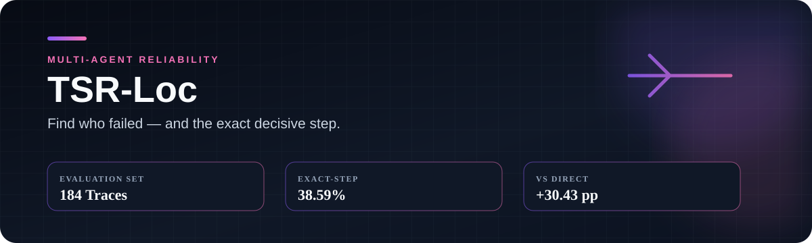
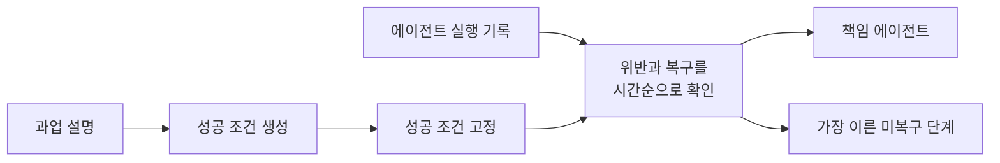
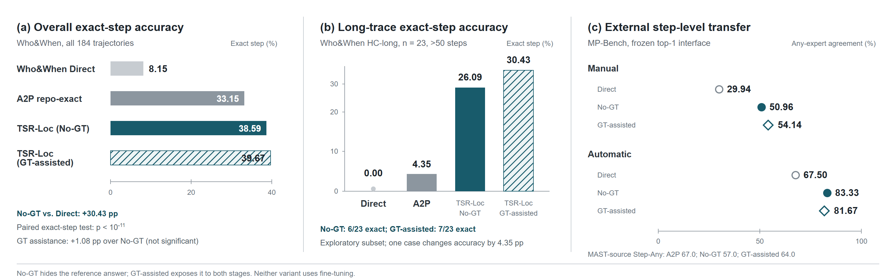

<div align="center">

# TSR-Loc: Multi-Agent Failure Localization

**과업의 성공 명세를 먼저 만든 뒤, execution trace와 대조해 earliest unrecovered failure를 찾습니다.**


[문제](#1-왜-실패-위치까지-찾아야-하는가) · [아이디어](#2-아이디어의-출발점-성공-명세를-trace보다-먼저-만든다) · [방법](#4-tsr-loc은-어떻게-찾는가) · [결과](#6-검증-결과) · [활용](#7-운영에서-어떻게-쓰는가) · [실행](#9-실행-방법)

</div>

## 1. 왜 실패 위치까지 찾아야 하는가

멀티에이전트 시스템은 하나의 작업을 계획, 검색, 도구 실행과 답변 작성으로 나눠 처리합니다. 최종 답변의 성공 여부만으로는 어느 에이전트의 어떤 행동부터 고쳐야 할지 알기 어렵습니다. 로그 전체를 사람이 다시 읽는 방법도 실행이 길어질수록 부담이 커집니다.

처음 나타난 오류를 고르는 것만으로도 부족합니다. 앞의 잘못된 시도가 뒤에서 바로잡혔다면 최종 실패와 직접 연결하기 어렵습니다. 반대로 마지막 단계에서 보인 오류는 앞선 판단이 누적된 결과일 수 있습니다. 회귀 테스트나 장애 분석에서 필요한 정보는 책임 에이전트와 함께, 최종 실패로 이어진 가장 이른 미복구 단계입니다.

이 프로젝트는 실패한 multi-agent execution에서 `Who`, 책임 에이전트와 `When`, 정확한 실패 단계를 함께 찾는 TSR-Loc을 제안하고 검증합니다.

| 조건 | 가정한 상황 |
|---|---|
| System | Planner, tool agent, reviewer처럼 여러 agent가 하나의 task를 이어서 처리합니다. |
| Observation | Agent와 global step이 표시된 전체 execution trace를 사후에 읽을 수 있습니다. |
| Model access | 내부 weight나 gradient를 쓰지 않는 black-box setting입니다. |
| Monitoring label | Localization 시점에는 gold failure agent와 step을 입력으로 사용하지 않습니다. |
| Output | 자동 수정 대신 사람이 먼저 확인할 `(agent, step)` 후보를 반환합니다. |

## 2. 아이디어의 출발점: 성공 명세를 trace보다 먼저 만든다

처음에는 긴 로그를 잘 나누면 실패 위치를 찾기 쉬울 것이라고 생각했습니다. 하지만 구간을 작게 나누면 원인과 복구 과정이 갈라지고, 크게 나누면 다시 긴 문맥을 판정해야 했습니다. 여기서 질문을 바꿨습니다.

> **과업이 성공하려면 지켜야 할 명세를 먼저 만들고, 실행 기록을 그 기준과 비교하면 실패 위치를 더 정확히 찾을 수 있지 않을까?**

TSR-Loc은 task description과 agent 목록만 보고 `task-derived success requirements`를 작성합니다. 이 명세는 trace, reference answer와 gold failure label을 보기 전에 고정합니다. 그다음 전체 trace를 시간순으로 읽으며 requirement 위반과 이후 복구 여부를 함께 확인합니다. 마지막까지 복구되지 않은 위반 중 가장 이른 `(agent, step)`을 반환합니다.

| 처음 시도한 기준 | TSR-Loc에서 바꾼 기준 |
|---|---|
| 긴 trace를 구간으로 나눈 뒤 의심 구간을 골랐습니다. | Trace를 보기 전에 판정 기준부터 고정합니다. |
| 선택한 구간 안에서 눈에 띄는 오류를 찾았습니다. | 성공 명세를 기준으로 위반과 복구를 끝까지 추적합니다. |
| 앞에서 발생했지만 이미 복구된 오류가 남을 수 있었습니다. | 복구된 위반은 제외하고 earliest unrecovered failure를 남깁니다. |

## 3. 분할 실험에서 성공 명세로

| 단계 | 판단과 결과 |
|---|---|
| 문제 정의 | 책임 에이전트와 정확한 결정적 실패 단계를 함께 찾아야 한다고 봤습니다. |
| 첫 접근 | 긴 로그가 원인이라고 생각해 고정 분할, 적응형 분할, 상위 구간 재검토와 재정렬을 비교했습니다. |
| 확인한 한계 | 작은 구간은 원인과 복구 과정을 갈라놓고, 큰 구간은 긴 문맥 문제로 돌아갔습니다. 구간 크기에 따라 성능도 흔들렸습니다. |
| 문제 재정의 | 로그를 어떻게 자를지보다 과업이 성공하려면 무엇을 끝까지 지켜야 하는지를 먼저 정하기로 했습니다. |
| 최종 방법 | 실행 기록을 보기 전에 성공 조건을 고정하고, 처음 위반한 뒤 끝까지 복구하지 못한 지점을 찾는 TSR-Loc을 만들었습니다. |
| 평가 | Who&When 184개 실행에서 Direct의 정확한 단계 일치율 8.15%를 38.59%로 높였습니다. |

분할 방법을 계속 복잡하게 만드는 대신, 실패를 판정할 기준이 먼저 필요하다고 봤습니다. TSR-Loc은 이 방향 전환에서 나온 방법입니다.


## 4. TSR-Loc은 어떻게 찾는가

Task가 성공하려면 지켜야 할 requirement를 trace inspection 전에 만들고 고정합니다. 그다음 전체 trace를 시간순으로 읽고, 뒤에서 복구된 위반은 제외합니다.


```mermaid
flowchart LR
    T["과업 설명"] --> C["성공 조건 생성"]
    C --> R["성공 조건 고정"]
    X["에이전트 실행 기록"] --> L["위반과 복구를<br/>시간순으로 확인"]
    R --> L
    L --> A["책임 에이전트"]
    L --> S["가장 이른 미복구 단계"]
```

1. 실행 기록을 보기 전에 과업 설명만으로 성공 조건을 만듭니다.
2. 조건을 고정한 뒤 실행 기록을 시간순으로 읽습니다.
3. 각 위반이 뒤에서 복구됐는지 확인합니다.
4. 끝까지 남은 위반 가운데 가장 이른 단계와 해당 에이전트를 반환합니다.

평가할 때는 이미 복구된 시도를 원인으로 고른 경우, 뒤늦게 나타난 증상을 고른 경우와 단계 번호가 어긋난 경우를 따로 살폈습니다. 비교 방법에도 같은 판정기를 사용했습니다.

아래 사례에서는 129-step trace의 마지막 오답이 아니라, 필요한 가격 정보를 처음 확보하지 못했고 이후에도 복구되지 않은 `WebSurfer, Step 4`를 찾습니다. 성공 조건을 trace보다 먼저 고정했기 때문에 뒤에 이어진 반복 시도에 판정 기준이 끌려가지 않습니다.


## 5. 평가 설계: label은 채점에만 사용

| 항목 | 설정 |
|---|---|
| 데이터 | Who&When AG 126건 + HC 58건, 총 184건 |
| 입력 | 과업 설명과 단계 번호가 붙은 전체 실행 기록 |
| TSR-Loc 성공 조건 | 실행 기록, 정답, 실패 라벨을 보기 전에 생성하고 고정 |
| 비교 방법 | Direct, A2P와 ECHO |
| 주요 실행 모델 | GPT-4o, temperature 0.0 |
| 평가 | 책임 에이전트 정확도와 정확한 단계 일치율을 분리해 계산 |

Localization 단계에서는 정답과 failure label을 입력으로 사용하지 않았습니다. Label은 예측이 끝난 뒤 책임 에이전트와 정확한 단계가 맞았는지 채점할 때만 사용했습니다. 성공 조건 337개는 두 명이 따로 검토했습니다. 유효하다고 판단한 비율은 각각 97.63%, 96.74%였고 Cohen's kappa는 0.838이었습니다.

원 benchmark에만 맞춘 결과인지 확인하려고 MP-Bench의 다중 annotation과 Who&When Pro의 prediction-blind 150개 cohort에서도 같은 No-GT 인터페이스를 평가했습니다. HC-long 23건은 반복해서 살펴본 사후 subset이므로 장기 trace 전체에 대한 일반화 근거로 사용하지 않았습니다.

## 6. 검증 결과

| 방법 | 책임 에이전트 정확도 | 정확한 단계 일치율 |
|---|---:|---:|
| Direct | 51.63% | 8.15% |
| A2P 재구현 | **63.04%** | 33.15% |
| ECHO, 별도 실험 | 기록하지 않음 | 26.09% |
| **TSR-Loc, 과업 정보만 사용** | 57.61% | **38.59%** |

TSR-Loc의 정확한 단계 일치율은 Direct보다 30.43%p 높았습니다. 대응표본 McNemar 검정의 p값은 `5.77e-12`였습니다.

A2P보다 정확한 단계 일치율은 5.44%p 높았지만 차이는 통계적으로 유의하지 않았습니다(`p=0.2954`). 따라서 A2P보다 우수하다고 해석하지 않았습니다. ECHO와 호출·token 수치는 main CSV와 분리된 실험 집계이며 주요 결론에는 사용하지 않았습니다. 주요 결과는 정답이나 실패 라벨 없이 과업 정보만으로 성공 조건을 만든 설정이며, 정답 보조 결과는 참고값입니다.



### 외부 benchmark에서도 같은 인터페이스를 적용했습니다

| Who&When Pro, 150건 | Agent | Step | Agent-Step |
|---|---:|---:|---:|
| 기존 Who&When prompt 전이 | 68.00% | 50.67% | 41.33% |
| **TSR-Loc, No-GT** | 64.00% | 68.00% | 57.33% |
| Pro 전용 공식 prompt | **70.00%** | **70.00%** | **62.67%** |

TSR-Loc은 기존 Who&When prompt를 그대로 옮긴 조건보다 Step에서 17.33%p, Agent-Step에서 16.00%p 높았습니다. 다만 Pro 전용 prompt가 수치상 더 높았으므로 Pro SOTA가 아니라, 새 framework와 task에서도 실패 단계 판정 방식이 유지되는지를 본 전이 결과로 해석했습니다.

MP-Bench Automatic 120건에서는 Step-Any가 Direct 67.50%에서 TSR-Loc 83.33%로, Role-Any가 27.50%에서 83.33%로 바뀌었습니다. 여러 전문가 중 한 명의 attribution과 일치하는지를 본 지표이며, 원 benchmark의 평가 시스템을 재현했다는 뜻은 아닙니다.

### 병목은 requirement 생성보다 trace localization에 가까웠습니다


같은 No-GT 조건에서 compiler와 localizer를 Llama-3.1-8B와 GPT-4o로 교차했습니다. Compiler만 바꾼 차이는 0.54~1.09%p였고, localizer를 바꾼 차이는 19.02~19.57%p였습니다. 이 model pair에서는 성공 조건을 만드는 단계보다 긴 trace에서 정확한 시간 경계를 고르는 단계가 성능에 더 민감했습니다. 경량 compiler가 통계적으로 동등하다는 주장은 하지 않습니다.

## 7. 운영에서 어떻게 쓰는가

| 적용 장면 | TSR-Loc이 제공하는 정보 |
|---|---|
| Multi-agent regression test | 실패한 trace를 agent와 exact step 기준으로 묶어 반복되는 failure pattern을 확인할 수 있습니다. |
| Incident triage | 긴 trace 전체를 다시 읽기 전에 수정 후보가 되는 earliest unrecovered step부터 검토할 수 있습니다. |
| Evaluator analysis | Agent selection과 step localization을 분리해 어느 쪽에서 평가기가 흔들리는지 볼 수 있습니다. |

TSR-Loc은 observability layer에서 실패 trace의 검토 시작점을 정하는 방법입니다. Root cause를 형식적으로 증명하거나 agent prompt와 tool policy를 자동으로 고치지는 않습니다.

## 8. 저장소 구성

```text
failure_attribution/   TSR-Loc, baseline·ablation, 모델 연결, 스키마와 평가 지표
configs/               인증 정보를 뺀 예시 설정
data/                  짧은 합성 실행 기록
results/               검증한 집계 결과표
scripts/               결과 점검과 보고서 생성 도구
tests/                 출력 파서와 프롬프트 규칙 테스트
docs/                  방법, 데이터, 실험 이력과 재현 조건
assets/                처리 예시와 검증 결과 그림
```

## 9. 실행 방법

```powershell
python -m venv .venv
.\.venv\Scripts\Activate.ps1
python -m pip install -e ".[test]"
powershell -ExecutionPolicy Bypass -File scripts\run_smoke.ps1 -Python python
```

위 명령은 직접 만든 짧은 실행 기록과 고정된 모의 모델로 전체 흐름을 확인합니다. 실제 벤치마크 결과를 다시 만드는 실행은 아닙니다. 전체 실험에는 원 벤치마크 데이터와 모델 API 인증 정보가 필요합니다.

자세한 내용은 [방법과 예시](docs/METHOD.md), [데이터와 평가 기준](docs/DATA_AND_EVALUATION.md), [실험 이력](docs/EXPERIMENT_HISTORY.md), [재현 조건](docs/REPRODUCIBILITY.md)에서 확인할 수 있습니다.

## 10. 해석 범위와 한계

- 주 결과는 Who&When AG와 HC 184건에서 얻었습니다. MP-Bench와 Who&When Pro 결과는 외부 전이 확인이며 실제 운영 장애 전체로 일반화하지 않습니다.
- A2P 결과는 공개 저장소의 프롬프트와 요청 방식을 맞춘 재구현이며 원 저자의 API 실행 결과가 아닙니다.
- ECHO와 호출·토큰 수치는 별도로 수행한 비교 실험의 집계값입니다.
- HC-long은 23건의 사후 subset입니다. 장기 trace 전반의 SOTA 근거로 사용하지 않습니다.
- Who&When Pro는 공개된 injected failure trace의 prediction-blind cohort입니다. Pro 전용 공식 prompt보다 우수하다고 주장하지 않습니다.
- TSR-Loc은 실패를 점검할 후보 위치를 찾습니다. 형식적인 인과관계를 증명하거나 시스템을 자동으로 고치지는 않습니다.
- 로그 분할 실험은 탐색 과정으로 남겼습니다. 모든 조건에서 분할이 효과적이었다고 주장하지 않습니다.
- 유료 API 키, 전체 벤치마크 데이터, 원시 예측 로그와 모델 체크포인트는 공개하지 않았습니다.
